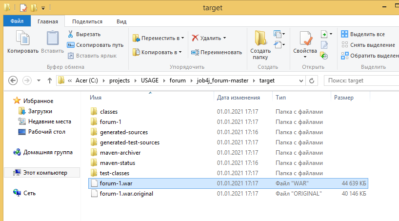
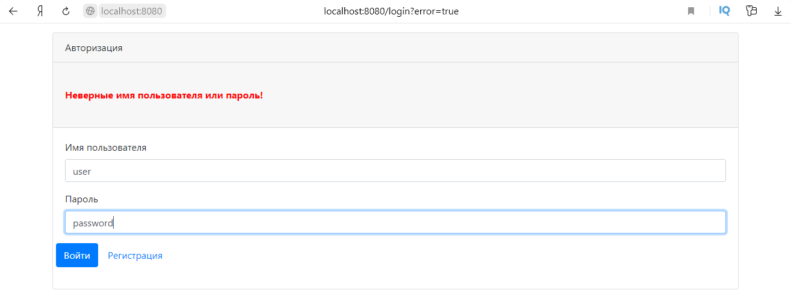

# Проект - Форум

# Содержание
* [Использованные технологии](#Использованные-технологии)
* [О проекте](#О-проекте)
* [Сборка](#Сборка)
* [Использование](#Использование)
* [Контакты](#Контакты)
## Использованные технологии
* Spring Boot
* Spring MVC
* Spring Test
* Spring Data JPA
* Spring Security
* Liquibase
* PostgreSQL
* Collections Framework
* Apache Commons DBCP (Database Connection Pooling)
* JSP
* JSTL
* HTML, CSS, Bootstrap
* JS, JQuery
* Heroku
* Travis CI
## О проекте
* Данное Spring Boot приложение представляет собой систему публикации постов:  
  
* При добавлении поста необходимо указать название и описание поста:  
  
  
* После добавления поста можно просмотреть подробную информацию о посте:  
  
* Есть возможность редактировать добавленные посты:  
  
  
  
* Неавторизованные пользователи с приложением работать не могут  
* Авторизация построена на Spring Security. Все зарегистрированные пользователи хранятся в БД. 
Все пароли пользователей хранятся в БД в закодированном виде. Форма авторизации:  
  
  
  
* Добавлена возможность регистрации новых пользователей. Регистрация основана на контроллере RegControl, 
который инициирует сохранение новых пользователей в БД. Форма регистрации:  
  
* По умолчанию в БД хранится пользователь с ролью администратора. Его логин - root, пароль - secret  
* Все формы приложения провалидированы с помощью JS и JQuery:  
  
  
  
* Приложение построено на трёх слоях: слой по работе с БД, слой контроллеров, слой сервисов  
* В качестве БД используется PostgreSQL  
* Работа с БД осуществляется через Spring Data JPA  
* Слой контроллеров использует Spring MVC  
* Слой сервисов содержит логику приложения  
* Проект построен по шаблону MVC. Все виды открываются через GET-методы контроллеров, 
что позволяет передавать на виды необходимые данные  
* В качестве видов используются JSP-страницы, реализованные с помощью HTML и Bootstrap  
* Для реализации логики отображения на видах используется JSTL  
* В качестве системы версионирования структуры БД используется Liquibase  
* На все контроллеры написаны тесты с помощью Spring Test  
* Приложение доступно на облачной платформе Heroku: 
[https://stark-reef-21545.herokuapp.com/login](https://stark-reef-21545.herokuapp.com/login)   
* Реализована интеграция Travis CI с Heroku.
## Сборка
1. Установить JDK 14.
2. Скачать Maven.
3. Создать переменные окружения JAVA_HOME и M2_HOME и прописать в переменную окружения Path 
пути до бинарных файлов для JDK и для Maven:  
  
4. Установить сервер БД PostgreSQL. При установке задать: 
    * имя пользователя - postgres 
    * пароль - root
    * порт - 5432 
Также при установке сервера БД PostgreSQL нужно установить программу pg_Admin.

5. Скачать исходный код проекта с GitHub.
6. Перейти в корень проекта, где лежит файл pom.xml:  
  
  
7. С помощью Maven осуществить сборку проекта:  
  
При успешной сборке должна появиться папка target, в которой располагается war-архив:  
  
  
  
8. Запустить сервер БД, указав путь до папки data:  
  
9. Запустить программу pg_Admin, установленную вместе с сервером БД PostgreSQL:  
  
10. Создать БД с названием forum:  
  
11. Открыть Query Tool для созданной БД и запустить SQL-скрипты schema.sql и security.schema.reg.sql, 
находящиеся в папке src/main/resources/db (папка src находится в корне скачанного проекта):  
  
  
  
Сборка завершена. Теперь можно проверить работу приложения.
## Использование
Переходим в папку target, где располагается собранный war-архив и запускаем Spring boot приложение:  
  
  
Переходим на главную страницу приложения 
[http://localhost:8080/](http://localhost:8080/):   
  
Как видно, мы были переведены на форму авторизации, что означает, что с приложением могут работать только авторизованные 
пользователи. По умолчанию в БД уже хранится один пользователь с ролью администратора. Поэтому мы можем войти через 
администратора (логин - root, пароль - secret):  
  
  
Теперь осуществим выход и зарегистрируем нового пользователя:  
  
  
Авторизуемся под только что созданным пользователем при этом введём некорректный пароль:  
  
  
Как видно, мы получили предупреждение. Теперь введём корректные данные:  
  
  
Добавим новый пост:  
  
  
Для просмотра подробной информации о посте нужно кликнуть по названию поста:  
  
Отредактируем добавленный пост:  
  
  
  
  
Проверим валидацию. Для этого нажмём на кнопки отправки форм, при этом не заполнив все поля форм:  
  
  
  
## Контакты
Почта: studentnstu97@mail.ru 
Skype: live:.cid.9cdc925fb48220b4